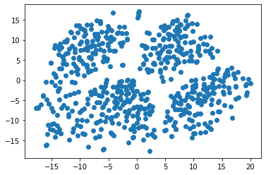
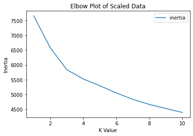

# unsupervised-machine-learning-challenge
## GA Tech Data Science and Analytics Boot Camp Module 20
### Description

In this module we utilize unsupervised machine learning to fit data to a model and use clustering algorithms to place data into groups.

This activity is broken into four parts:

* <b>Part 1: Prepare the Data</b>

To prepare the data, we remove the MYOPIC target column that would create bias for unsupervised modeling. This column would be more beneficial for supervised modeling. We then standardize the data using the StandardScaler from sklearn.

* <b>Part 2: Apply Dimensionality Reduction</b>

After the data is prepared, we reduce the dataset by applying the  dimentionality reduction technique PCA. This assignment calls for an n-component of 90% of the explained variance.

We further reduce the dataset dimension with t-SNE and display our results on a scatter plot.

* <b>Part 3: Perform a Cluster Analysis with K-means</b>

To identify the best number of clusters, we create an elbow plot for the k-means values. We achieve this by creating a for loop to determine the inertia for k between 1 through 10.

Based on the plot above, we can see that the elbow is roughly around 3.

* Part 4: Make a Recommendation

Based on our findings, we can conclude that the patients could be clustered together. The point in which our elbow plot bends is at about 3. These clusters can also be seen in the scatterplot.

### Submission Requirements
* <a href="MyopiaClusters.ipynb">Jupyter Notebook</a>
* Conclusion

## Disclaimer

Program may fail with recent numpy version. Downgrading to numpy 1.21.4 will fix this issue. <a href="https://stackoverflow.com/questions/71352354/sklearn-kmeans-is-not-working-as-i-only-get-nonetype-object-has-no-attribute">Source</a>
